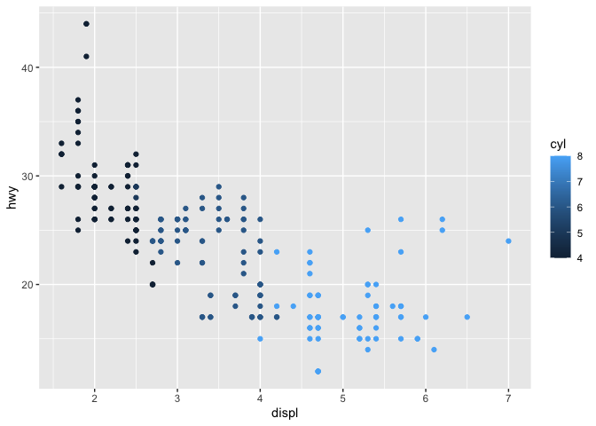
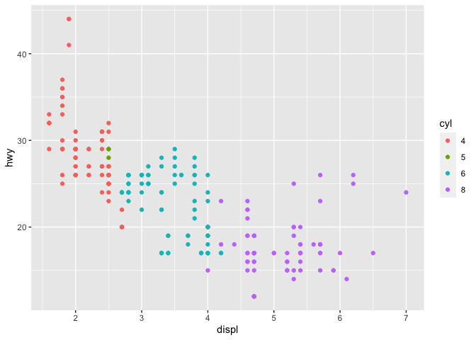
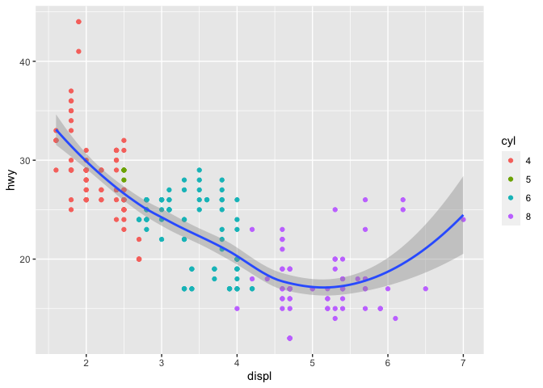
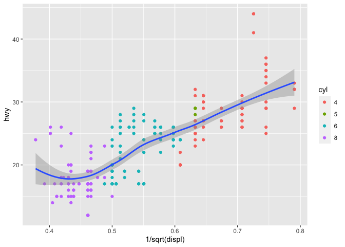

MA615 Lecture 2
================
Gia Bao (Belinda) Ngo

# Setting up R

``` r
# install.packages("tidyverse") # it may take a while!
library(tidyverse)
```

    ## ── Attaching core tidyverse packages ──────────────────────── tidyverse 2.0.0 ──
    ## ✔ dplyr     1.1.4     ✔ readr     2.1.4
    ## ✔ forcats   1.0.0     ✔ stringr   1.5.1
    ## ✔ ggplot2   3.4.4     ✔ tibble    3.2.1
    ## ✔ lubridate 1.9.3     ✔ tidyr     1.3.0
    ## ✔ purrr     1.1.0     
    ## ── Conflicts ────────────────────────────────────────── tidyverse_conflicts() ──
    ## ✖ dplyr::filter() masks stats::filter()
    ## ✖ dplyr::lag()    masks stats::lag()
    ## ℹ Use the conflicted package (<http://conflicted.r-lib.org/>) to force all conflicts to become errors

# Checking the data

Dataset mpg1: fuel economy data

``` r
mpg
```

    ## # A tibble: 234 × 11
    ##    manufacturer model      displ  year   cyl trans drv     cty   hwy fl    class
    ##    <chr>        <chr>      <dbl> <int> <int> <chr> <chr> <int> <int> <chr> <chr>
    ##  1 audi         a4           1.8  1999     4 auto… f        18    29 p     comp…
    ##  2 audi         a4           1.8  1999     4 manu… f        21    29 p     comp…
    ##  3 audi         a4           2    2008     4 manu… f        20    31 p     comp…
    ##  4 audi         a4           2    2008     4 auto… f        21    30 p     comp…
    ##  5 audi         a4           2.8  1999     6 auto… f        16    26 p     comp…
    ##  6 audi         a4           2.8  1999     6 manu… f        18    26 p     comp…
    ##  7 audi         a4           3.1  2008     6 auto… f        18    27 p     comp…
    ##  8 audi         a4 quattro   1.8  1999     4 manu… 4        18    26 p     comp…
    ##  9 audi         a4 quattro   1.8  1999     4 auto… 4        16    25 p     comp…
    ## 10 audi         a4 quattro   2    2008     4 manu… 4        20    28 p     comp…
    ## # ℹ 224 more rows

``` r
# to see a description, either
help(mpg)
?mpg
```

# Exploring the data

Question of *interest*: relationship between displ (engine displacement
in litres) and hwy (highway mileage)

``` r
ggplot(data = mpg, mapping = aes(x = displ, y = hwy)) + geom_point()
```

<!-- -->

Mileage seems to *decrease* with engine size; what is the effect of cyl
(number of cylinders)?

``` r
ggplot(data = mpg, mapping = aes(x = displ, y = hwy)) +
  geom_point(aes(color = cyl))
```

<!-- -->

cyl has only a few values so it’s best seen as a factor (categorical)

``` r
ggplot(data = mpg |> mutate(cyl = factor(cyl)),
       aes(x = displ, y = hwy)) + geom_point(aes(color = cyl))
```

<!-- -->

# A bit of modeling

``` r
ggplot(mpg |> mutate(cyl = factor(cyl)), aes(displ, hwy)) +
  geom_point(aes(color = cyl)) +
  geom_smooth()
```

    ## `geom_smooth()` using method = 'loess' and formula = 'y ~ x'

<!-- -->

Model fitting yields

``` r
fit <- lm(log(hwy) ~ log(displ), data = mpg)
coef(fit)
```

    ## (Intercept)  log(displ) 
    ##   3.7640700  -0.5471563

``` r
ggplot(mpg |> mutate(cyl = factor(cyl)),
       aes(1 / sqrt(displ), hwy)) +
  geom_point(aes(color = cyl)) +
  geom_smooth()
```

    ## `geom_smooth()` using method = 'loess' and formula = 'y ~ x'

<!-- -->
