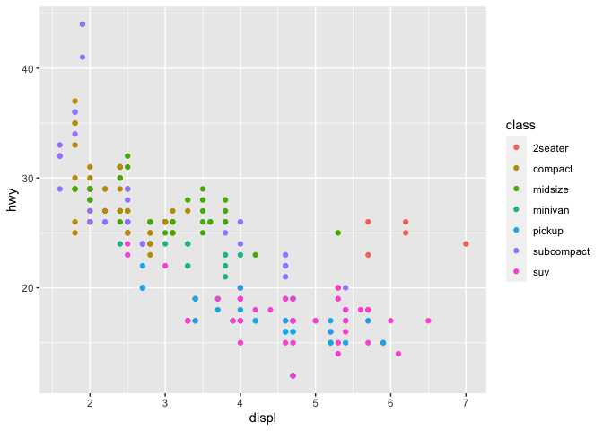

lecture-3
================
Gia Bao (Belinda) Ngo

# Lecture 3: Data visualization

## `ggplot`: Grammar of Graphics

We can follow a general template:
`ggplot(data = <DATA>) + <GEOM_FUNCTION>(mapping = aes(<MAPPINGS>))`

For instance, we may be concerned about a group of outliers:

``` r
library(tidyverse)
```

    ## ── Attaching core tidyverse packages ──────────────────────── tidyverse 2.0.0 ──
    ## ✔ dplyr     1.1.4     ✔ readr     2.1.4
    ## ✔ forcats   1.0.0     ✔ stringr   1.5.1
    ## ✔ ggplot2   3.4.4     ✔ tibble    3.2.1
    ## ✔ lubridate 1.9.3     ✔ tidyr     1.3.0
    ## ✔ purrr     1.1.0     
    ## ── Conflicts ────────────────────────────────────────── tidyverse_conflicts() ──
    ## ✖ dplyr::filter() masks stats::filter()
    ## ✖ dplyr::lag()    masks stats::lag()
    ## ℹ Use the conflicted package (<http://conflicted.r-lib.org/>) to force all conflicts to become errors

``` r
ggplot(data = mpg) +
  geom_point(mapping = aes(x = displ, y = hwy, color = class))
```

<!-- -->

``` r
ggplot(data = mpg) +
  geom_point(mapping = aes(x = displ, y = hwy, color = class, shape = factor(cyl)))
```

<!-- -->

We can also simplify the command by assuming the right *named*
arguments:
`ggplot(mpg) + geom_point(aes(x = displ, y = hwy, color = class, shape = factor(cyl)))`

``` r
ggplot(mpg) +
  geom_point(aes(x = displ, y = hwy, color = class, shape = factor(cyl))) +
  geom_smooth(aes(x = displ, y = hwy))
```

    ## `geom_smooth()` using method = 'loess' and formula = 'y ~ x'

<!-- -->

To avoid redundancies, we can declare **shared mappings** in `ggplot`:
`ggplot(mpg, aes(x = displ, y = hwy)) + geom_point(aes(color = class, shape = factor(cyl))) + geom_smooth()`

Each `geom_function` can have its own mappings: coloring by `drv`

``` r
ggplot(mpg, aes(x = displ, y = hwy)) +
  geom_point(aes(color = drv, shape = factor(cyl))) +
  geom_smooth(aes(color = drv), se = FALSE)
```

    ## `geom_smooth()` using method = 'loess' and formula = 'y ~ x'

<!-- -->

We don’t need to specify an aesthetic to group values:

``` r
ggplot(mpg, aes(x = displ, y = hwy)) +
  geom_point(aes(color = drv, shape = factor(cyl))) +
  geom_smooth(aes(group = drv))
```

    ## `geom_smooth()` using method = 'loess' and formula = 'y ~ x'

<!-- -->

``` r
ggplot(mpg, aes(x = displ, y = hwy)) +
  geom_point(aes(color = drv)) +
  geom_smooth(aes(color = drv, linetype = drv), se = FALSE)
```

    ## `geom_smooth()` using method = 'loess' and formula = 'y ~ x'

<!-- -->

**Facets** are another useful way to add variables to a plot:

``` r
ggplot(mpg, aes(x = displ, y = hwy)) +
  geom_point(aes(color = drv)) +
  facet_wrap(~ class)
```

<!-- -->

For two variables, we can use `facet_grid`:

``` r
ggplot(mpg, aes(x = displ, y = hwy)) +
  geom_point(aes(color = class)) +
  facet_grid(drv ~ cyl)
```

<!-- -->

``` r
ggplot(mpg, aes(x = displ, y = hwy)) +
  geom_point(aes(color = cyl)) +
  geom_smooth(se = FALSE) +
  facet_wrap(~ drv)
```

    ## `geom_smooth()` using method = 'loess' and formula = 'y ~ x'

<!-- -->
